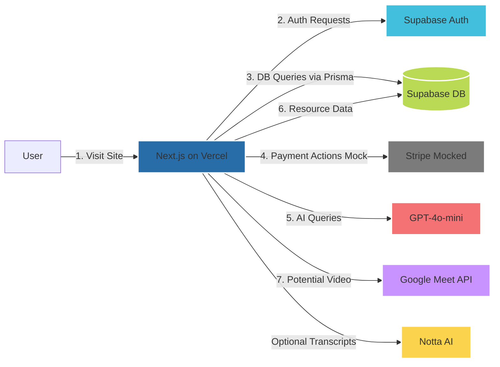
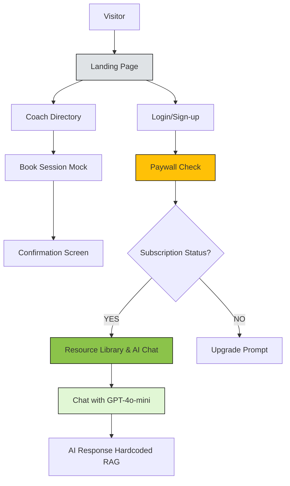

# DCC MVP Architecture Overview

This markdown file outlines the high-level architecture of the **Dental Coaching Collective (DCC)** MVP. The MVP includes:

1. **Live Coaching (Front of Paywall)**
2. **AI Auto-Coaching & Resource Library (Behind Paywall)**
3. **Mocked Payment Flow (Stripe)**
4. **AI Chatbot (Hardcoded Retrieval)**
5. **Optional Future Integrations** (e.g., Google Meet API for live sessions, Notta AI for transcripts)

---

## Tech Stack

- **Next.js**:  
  - Front-end framework (React-based)  
  - Deployed on [Vercel](https://vercel.com/) for rapid continuous deployment
  
- **Supabase**:  
  - Database (PostgreSQL)  
  - Authentication for user sign-up/login  
  - Real-time APIs and easy integration with Next.js
  
- **Prisma**:  
  - ORM layer, type-safe queries, and schema migrations

- **Stripe (Mocked for MVP)**:  
  - Payment and subscription management  
  - In the MVP, display a mock checkout flow to illustrate feasibility

- **GPT-4o-mini (Mocked RAG)**:  
  - AI model for chatbot responses (can substitute GPT-3.5 or GPT-4 as needed)  
  - Hardcoded transcripts or Q&A pairs to emulate retrieval

- **Notta AI** (optional for demo data):  
  - Generate transcripts from meetings or videos that can be used in the Resource Library

- **Google Meet API** (future):  
  - Potential integration for live video sessions and scheduling

---

## System Architecture

Below is a high-level diagram showing how each component of the MVP connects:

## User Flow

## Flow Description

1. **Landing Page**: Public marketing page with overview of DCC
2. **Coach Directory**: Public page listing available coaches (front-of-paywall)
3. **Mock Booking**: User selects a time; payment is mocked for the MVP
4. **Login/Sign-up**: Required to access premium (AI & Resources)
5. **Paywall Check**: System checks subscriptionStatus in Supabase
6. **If Subscribed**: Access the Resource Library and AI Chat
7. **If Not Subscribed**: Prompt user to "Upgrade" (mock Stripe flow)
8. **AI Chat**: GPT-4o-mini (or GPT-3.5/4) returns answers referencing hardcoded transcripts or docs